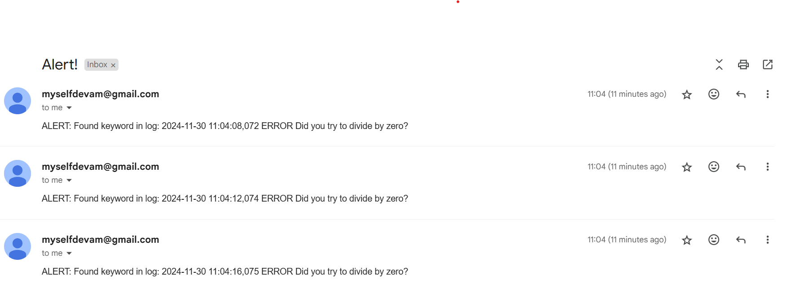

# Log File Monitoring and Alerting

---

## **Overview**
This project demonstrates a **log file monitoring system** using Python. The system automatically monitors a log file for specific keywords (e.g., `ERROR`, `CRITICAL`) and sends alerts whenever these keywords are detected. The workflow involves three files:

1. **`logMessage.py`**: Generates log messages (including errors) for testing the monitoring system.
2. **`monitor_script.py`**: Monitors the log file in real time and triggers alerts when specific keywords are detected.
3. **`sendMail.py`**: Sends email notifications when an alert is triggered.

---

## **Workflow**
1. **Log Generation (`logMessage.py`)**:
   - Simulates log messages being written to a file (`newfile.log`).
   - Handles scenarios like division by zero to generate `ERROR` logs.

2. **Log Monitoring (`monitor_script.py`)**:
   - Monitors the log file (`newfile.log`) for changes using the `watchdog` library.
   - Reads new log entries and checks if they contain specific keywords (e.g., `ERROR`, `CRITICAL`).
   - Triggers an alert (sends an email) when a keyword is found.

3. **Alerting (`sendMail.py`)**:
   - Sends an email notification with the relevant log entry to a predefined recipient.
   - This script can be expanded to include other alerting mechanisms (e.g., Slack notifications).

