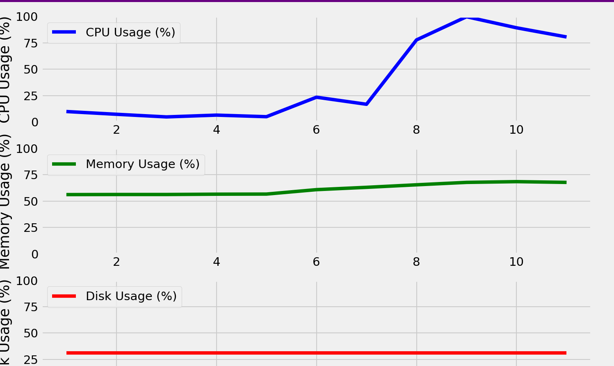
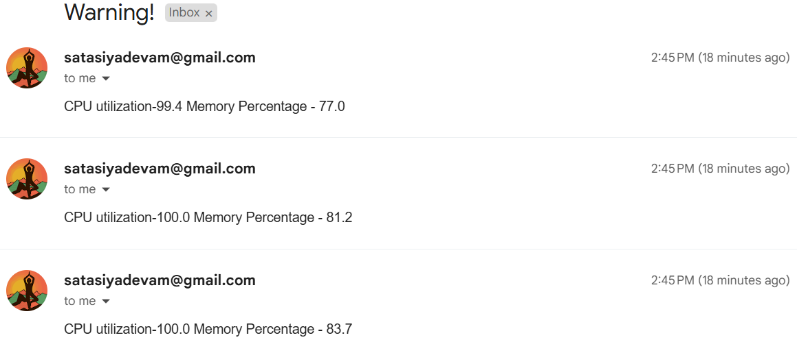

# System Metric Monitoring

This project monitors system metrics such as CPU usage, memory usage, and disk usage in real time. It also integrates email notifications using the `Log_file_monitoring` module.

## Features

- Real-time monitoring of:
  - **CPU Usage**
  - **Memory Usage**
  - **Disk Usage**
- Email notifications via the `sendMail` module.

## Dependencies

- psutil:
  - **For system metric monitoring**
  - **Memory Usage**
  - **Disk Usage**
- matplotlib:
  - For visualizing CPU and memory usage

